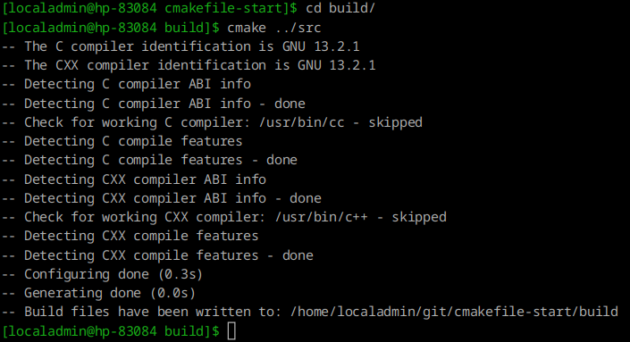
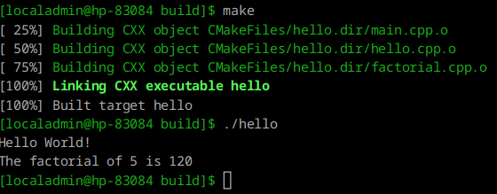

# cmakefile-start

```bash
apt-get install gcc-c++
apt-get install cmake
```

```bash
$ cmake --version
cmake version 3.31.7
```

## Создаем CMakeLists.txt

Это основной файл, который CMake использует для описания проекта.

```bash

# Указываем минимальную версию CMake, которую будем использовать
cmake_minimum_required(VERSION 3.31.7)

# Назовём проект
project(Hello)

# Добавляем исполняемый файл, указывая исходные файлы
add_executable(hello main.cpp hello.cpp factorial.cpp)

```

Создаем папку build и запускаем указываем, где находится CMakeLists.txt

```bash
cmake ../src
```



Далее запускаем make




